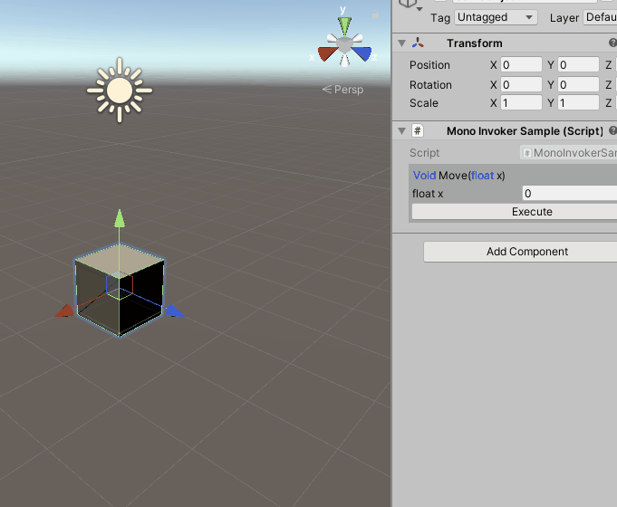

# MonoInvoker 

## step

1. In monobehaviour class, add [TestMethod] above method. you want simply call.
2. now you can see method call interface in inspector.

## todo
1. add list parameter.
2. serialize parameter values. 
3. implement package manager compatibility.

## Example

```csharp
using System.Collections;
using System.Collections.Generic;
using UnityEngine;

public class MonoInvokerSample : MonoBehaviour
{    
    [TestMethod]
    void Move(float x)
    {
        transform.Translate(x,0,0);    
    }
}
```


# Caution

1.You can write parameter like [TestMethod(false)], if you dont want play in editor mode. 
    basically, if a method contains StartCoroutine, it doent work in editor mode.
    
2.If you use custom editor. editor class have to inherit MonoInvoker.MonoBehaviourEditor not UnityEditor.Editor.

```csharp
//part of EditorClass
[CustomEditor (typeof (Tester), true)]
public class TestEditor : MonoInvoker.MonoBehaviourEditor {
     public override void OnInspectorGUI () {
         base.OnInspectorGUI();
         
         //your code.
     }
}
```

